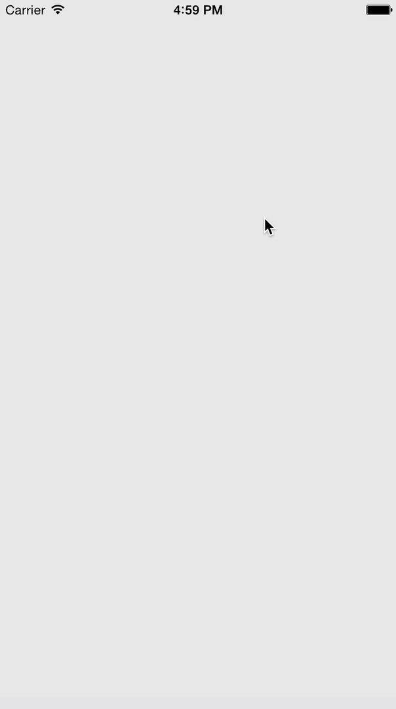

ESFeedbackViewController
========================

`ESFeedbackViewController` is an iOS library to show a feedback screen within an application. It shows a set of prompts, one after the other. Depending on what the user chooses in each step, the final input can end up being:

* A written suggestion.
* A review in the App Store.





### Usage

In your `AppDelegate`, once the application finished launching, add:
```objc
- (BOOL)application:(UIApplication *)application didFinishLaunchingWithOptions:(NSDictionary *)launchOptions {
  ...

  // The required number of application launches to show the feedback screen.
  [ESFeedbackViewController setNumberOfLaunchesToShow:NUMBER_OF_LAUNCHES];
  
  // The app ID, required to show redirect the user to the App Store.
  [ESFeedbackViewController setAppID:APP_ID];
  
  // Register that the application was launched.
  [ESFeedbackViewController registerAppLaunch];

  ...
}
```

#### Displaying

Once `[ESFeedbackViewController registerAppLaunch]` was called, the feedback screen can be shown in any point of the app using the `showIfNecessary` method. For example:
```objc
@implementation MyViewController

- (void)viewDidAppear:(BOOL)animated {
  [super viewDidAppear:animated];
  [ESFeedbackViewController showIfNecessary];
}  

@end
```

#### Input tracking

To track the input that the user performs step by step, a callback is provided. It is called each time the user dismisses a prompt. It receives a view controller that represents the dismissed prompt, and a boolean indicating if the user chose to continue or to cancel. Can be useful to hit an analytics/backend server to store the input:
```objc
[ESFeedbackViewController setOnPromptWasDismissed:^(ESFeedbackPromptViewController *promptVC, BOOL ok) {
  NSLog(ok ? @"Pressed OK" : @"Pressed Cancel");

  if (promptVC.inputText.length > 0) {
    // If the prompt view controller has any way to input text, it can be accessed through the inputText property.
    NSLog(@"Input text: %@", promptVC.inputText);
  }
}];
```

#### Customization

As an UI addon, the text and buttons font can be customized:
```objc
[ESFeedbackViewController setTextFont:TEXT_FONT];
[ESFeedbackViewController setButtonsFont:BUTTONS_FONT];
```


### License

This library is available under the [MIT license](http://www.opensource.org/licenses/mit-license.php).
